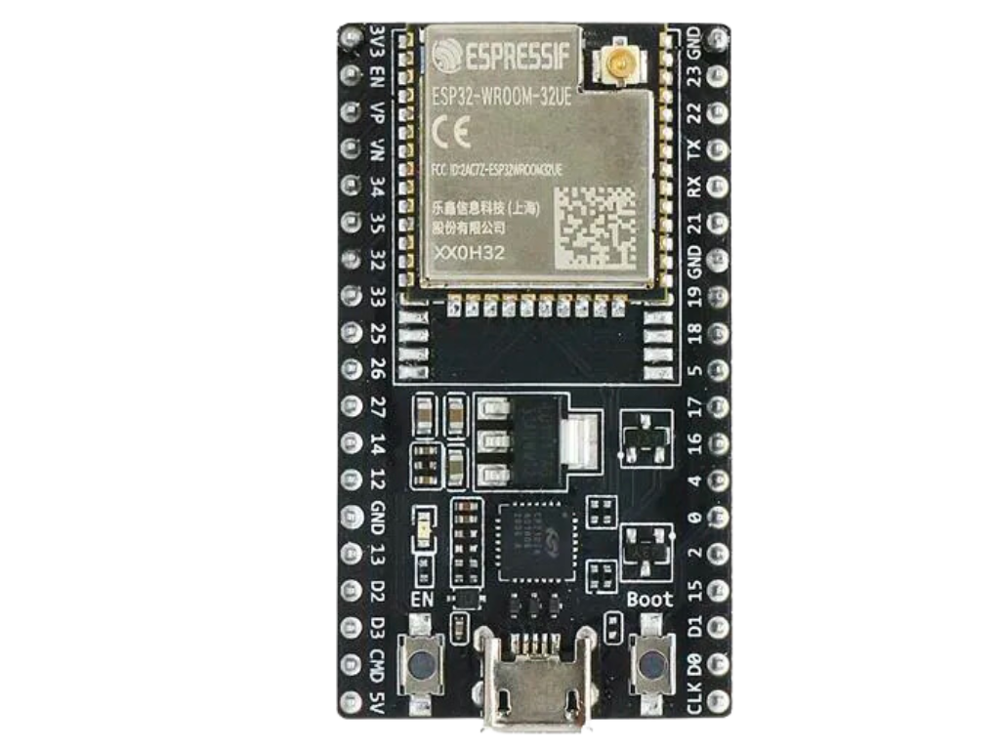

# Example Project

## Background

This project bla bla bla

## Equipment

* 2 eggs
* 1 cup of flour
* salt
* milk

## Tips and tricks

This is **bold text**, now *italics*.

Here is a [link to the code folder](code), and here is a link for the [blink code](code/blink.ino)

It is easy to display images here:

